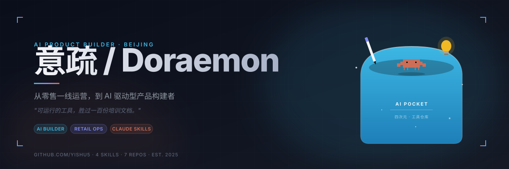

<div align="center">



<br/>

> *"用 AI 让普通人变强；用方法把复杂的事变简单；用行动把人生带到更高的位置。"*

<br/>

</div>

---

## 🧭 About Me

从零售一线运营到 AI 驱动型产品构建者。

我在北京零售市场做过门店增长，深度参与了即时零售的获客实战——亲历了那种"SOP 是墙上一张纸，员工根本执行不了"的无力感之后，我开始相信：**可运行的工具，胜过一百份培训文档。**

于是我开始用代码和 AI，把那些无人解决的效率问题，变成可以交付的产品。

```
📍 北京 · 零售增长 / 新媒体运营 → AI 产品构建
🔭 专注：AI Workflow · Prompt Engineering · 产品 0→1
💬 话题：用户增长 / SOP 自动化 / 低代码落地
```

---

## 📌 Pinned

<div align="center">
<table>
<tr>
<td width="50%" valign="top">

<a href="https://github.com/YiShu5/lobster-skills">
  
</a>

**Claude Code Skills 集合 · 经过实战打磨**

clawd-animation 像素动画 + self-improving-agent 经验沉淀器。三原则：触发器式 description、token 预算管理、硬约束。


</td>
<td width="50%" valign="top">

<a href="https://github.com/YiShu5/GZHcomposing">
  
</a>

**意疏的AI口袋 · 公众号排版器**

哆啦A梦口袋风格，实时双栏编辑，Markdown一键转换。


</td>
</tr>
<tr>
<td width="50%" valign="top">

<a href="https://github.com/YiShu5/feishu-imghost">
  
</a>

**Markdown 图床转存 · 防盗链突破**

复制任意文章 → 图片自动转存 GitHub → 飞书一键粘贴。


</td>
<td width="50%" valign="top">

<a href="https://github.com/YiShu5/content-curation">
  
</a>

**每日内容策展 · AI 降噪系统**

YouTube/B站/小宇宙 → AI 深度摘要 → 飞书 + 博客。


</td>
</tr>
</table>
</div>

---

## 🚀 Project Showcase

<table>
<tr>
<td width="50%" valign="top">

### 🧠 [My Brain — AI 智能收藏夹](https://github.com/YiShu5/my-bookmarks)

**高密度知识萃取器 · 解决信息过载**

> 收藏一个链接的瞬间，就是提炼知识的瞬间。

每次收藏，DeepSeek 自动阅读全文 → 生成摘要 → 结构化知识笔记 → 语义标签。你得到的不是一个死链接，而是一张随时可激活的知识卡片。

**核心能力：**
- 🤖 双通道 AI 并发：快速摘要 + 深度提炼
- 📸 Readability 全文快照，内容永不 404
- 📱 PWA + Web Share Target，手机原生体验
- 📋 剪贴板 FAB，Ctrl+V 盲狙式无感收藏

`Next.js 14` `DeepSeek` `SQLite` `PWA` `Tailwind`

</td>
<td width="50%" valign="top">

### 📈 [美评宝 — Business Growth](https://github.com/YiShu5/meipingbao)

**门店运营 SOP 自动化工具 · 实战于北京零售市场**

> 把 SOP 从文档变成工具，让每个门店员工都能执行专业级获客动作。

为零售门店打造的运营执行平台。AI 秒生成平台调性评价，覆盖抖音小时达 / 美团 / 饿了么全链路 SOP。

**核心能力：**
- ⚡ 6 大品类 × 6 种风格，2 秒生成内容
- 📚 三大即时零售平台运营方法库
- 💬 门店反馈闭环，持续迭代
- 🚀 无数据库无登录，部署即用

`Next.js 16` `DeepSeek` `Tailwind 4` `Edge Deploy`

</td>
</tr>
<tr>
<td width="50%" valign="top">

### 🔄 [PicSync — Markdown 图床转存](https://github.com/YiShu5/feishu-imghost)

**防盗链突破 · GitHub 图床 · 飞书富文本**

> 从知乎复制的图，粘进飞书就挂——这个问题解决了。

Chrome 插件自动识别 Markdown 中所有图片链接，并发下载后上传 GitHub，生成永久 CDN 链接，直接粘入飞书、Notion、掘金等平台即时显示。

**核心能力：**
- 🔗 内置语雀 / 知乎 / 微博 / 微信公众号 Referer 规则，无感突破防盗链
- ⚡ 并发下载 + 串行上传，彻底解决 GitHub API 并发冲突
- 📋 飞书富文本一键粘贴，图片即时显示
- 🗂️ 历史记录网格，支持复制 URL / Markdown / 从 GitHub 删除

`Chrome Extension MV3` `GitHub API` `declarativeNetRequest` `JavaScript`

</td>
<td width="50%" valign="top">

### 🔇 [NoiseFilter — 每日内容策展](https://github.com/YiShu5/content-curation)

**AI 降噪系统 · 从海量信息中提炼信号**

> 每天 720,000 小时视频上传到 YouTube，你不需要看完，你需要降噪。

全自动化内容策展管道：抓取 YouTube / Bilibili / 小宇宙 → BibiGPT 转录 → DeepSeek 深度改写 → 飞书多维表格归档 → 降噪风格博客展示。一条命令，5 分钟获取一小时播客的全部精华。

**核心能力：**
- 🎯 三平台统一抓取，yt-dlp + feedparser 双引擎
- 🧠 AI 深度改写：中文标题重拟 + 金句提取 + 核心观点 + 1500字摘要
- 📊 飞书多维表格自动同步，封面图一键上传
- 🌐 内置降噪风格博客，三列卡片 + 详情页开箱即用

`Python` `Node.js` `DeepSeek` `Flask` `飞书 API` `BibiGPT`

</td>
</tr>
<tr>
<td width="50%" valign="top">

### 🧈 [意疏的AI口袋 — 公众号排版器](https://github.com/YiShu5/GZHcomposing)

**哆啦A梦口袋风格 · 新媒体运营效率工具**

> 好的排版不仅是视觉上的美感，更是对读者阅读体验的尊重。

哆啦A梦口袋主题的微信公众号排版工具。实时双栏编辑、Markdown解析、多套预设风格一键切换。

**核心能力：**
- 🎨 8种排版模式 + 哆啦A梦主题皮肤
- ⚡ 实时预览，所见即所得
- 📋 一键复制到公众号，富文本直接粘贴
- 🔧 设计开头总结框、小标题、结尾模块

`HTML5` `CSS3` `JavaScript` `Contenteditable`

</td>
<td width="50%" valign="top">
</td>
</tr>
</table>

---

## ⚡ Tech Stack

**AI & Backend**


**Frontend & Framework**


**Product & Growth**


---

## 📊 GitHub Stats

<div align="center">


</div>

---

## 💡 产品哲学

> *"好的产品是用完即走的。"*
> — 张小龙

不追求停留时长，不制造焦虑式留存。AI 工具的价值在于"省下的时间"，而不是"占据的时间"。

> *"善良比聪明更重要。"*
> — 张小龙

技术可以放大善意，也可以放大伤害。在做任何 AI 产品决策时，先问"它对用户友善吗"，再问"它聪明吗"。

> *"再小的个体，也有自己的品牌。"*
> — 张小龙

这句话是我从零售运营跨界到 AI 产品的底层信念——AI 时代每个普通人都能拥有自己的工具链、自己的产出能力、自己的话语权。我做的每一个工具，都希望让"个体"变得更强。

---

<div align="center">

**行动比完美的 PPT 更有价值。**

<br/>


</div>
